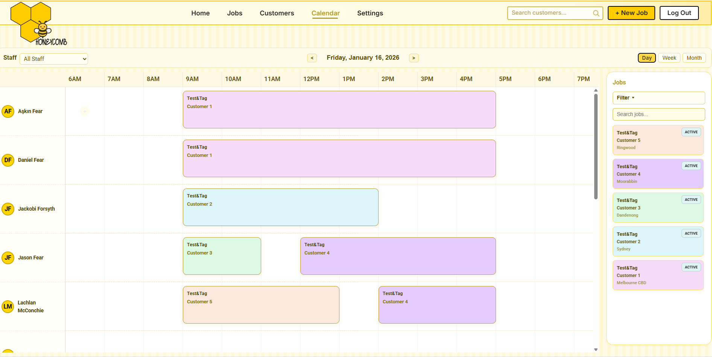

# 🐝 Honeycomb Dev

**Honeycomb Dev** is a smart, modern job and workflow management platform designed for businesses that need to manage teams, schedules, and tasks efficiently — all in one place.

Built with a strong focus on **clarity**, **performance**, and **real-world usability**.

---

## 📸 Preview



> Interactive calendar view with job scheduling and team assignments

---

## 👨‍💻 About the Developer

Hi! I’m **Aşkın Fear**,  
a **Mechanical Engineer** turned **Full Stack Developer** passionate about combining engineering logic with intuitive software design.

I enjoy building practical, scalable, and data-driven systems that simplify how businesses operate — from scheduling and reporting to automation and performance tracking.

🌐 **GitHub:** https://github.com/wild-butterfly

---

## 🚀 Project Overview

Honeycomb Dev provides a flexible foundation for job and workflow management systems, including:

- 📅 **Interactive Calendar**
  - Day / Week / Month views
- 👥 **Team & Staff Management**
  - Filter jobs by assigned employees
- 📋 **Job & Task Scheduling**
- 📱 **Responsive Design**
  - Optimized for desktop and mobile
- ⚡ **Fast & Modern Frontend**
  - Built with Vite + TypeScript
- 🔍 **Scalable Architecture**
  - Designed for future backend & API expansion

This project is designed to be adaptable for a wide range of businesses — from field services to internal operations teams.

---

## 🛠 Tech Stack

| Category          | Technologies                   |
| ----------------- | ------------------------------ |
| Frontend          | React, TypeScript, Vite        |
| Styling           | CSS Modules, Responsive Layout |
| State & Logic     | React Hooks                    |
| Tooling           | Git, GitHub                    |
| Backend (Planned) | Firebase / Node.js             |

---

## 🧭 Branch Strategy

- `main` → Stable and production-ready code
- `feature/*` → Feature development branches  
  _(e.g. `feature/mobile-layout-update`)_
- `dev` → Optional integration branch before merging to main

---

## 🧩 Getting Started

Clone the repository and run it locally:

```bash
# Clone the repository
git clone https://github.com/wild-butterfly/honeycomb-dev.git

# Navigate into the project folder
cd honeycomb-dev

# Install dependencies
npm install

# Start the development server
npm run start
```
